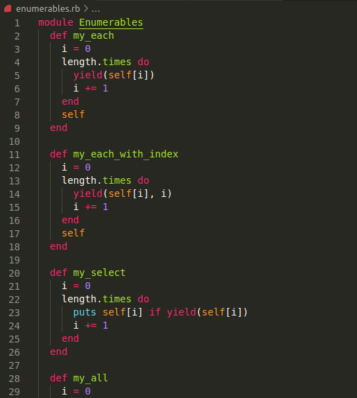

# Week 1 Enumerables

## Screenshot



## Built With

- Ruby
- Linters

## Getting Started

First ensure that you have ruby installed on your local machine.
To get a local copy up and running follow these simple example steps.

## Prequisites

Ruby installed on your local machine.
Code editor (like VSCode)
Terminal or similar to execute the program.

## Install

Download a copy of the enumerables.rb file

## Usage

Place the file on the same folder as your project and include it on your script
Use the different methods like so

### my_each

```testarray.my_each { |x| puts "The number is #{x}" }```

Returns every item of your array

### my_each_with_index

```testarray.my_each_with_index { |val,index| puts "index: #{index} for #{val}" }```

Returns every item of your array along with the index

### my_select

```testarray.my_select { |n| n.even? }```

Returns every item of the array that matches your query

### my_all

```puts testarray.my_all { |n| n < 20 }```

Returns true if all the elements of your array match the query

### my_none

```puts testarray.my_none { |n| n < 20 }```

Returns true if all the elements of your array don't match the query

### my_any

```puts testarray.my_any { |n| n == 20 }```

Returns true if at least one element of the array matches the query

### my_count

```puts testarray.my_count { |n| n.even? }```

Returns the number of elements in your array that match the query

### my_map

```square = Proc.new { |x| x**2 }```

```puts testarray.my_map { |x| x**2 }```

```puts testarray.my_map(square)```

Can be used with a block or a proc (prioritizes the proc). Return the modified elements according to the query

### my_inject

```puts testarray.my_inject { |sum, n| sum * n }```

Returns the sum of all the elements according to the query

### multiply_els

```puts multiply_els([2,4,5])```

This method uses my_map to multiply the elements of an array with a sum


## Authors

👤 Sergio Cortes Satizabal

- GitHub: [@githubhandle](https://github.com/sergiocortessat)
- Twitter: [@twitterhandle](https://twitter.com/sergiocortessat)

👤 Gregorio Rábago Sainz

- GitHub: [@githubhandle](https://github.com/greg0109)
- Twitter: [@twitterhandle](https://twitter.com/greg_0109)

## 🤝 Contributing

Contributions, issues, and feature requests are welcome!

Feel free to check the [issues page](https://github.com/sergiocortessat/Ruby-Milestone1-BubleSort/issues).

## Show your support

Give a ⭐️ if you like this project!

## Acknowledgments

- Hat tip to anyone whose code was used
- Inspiration
- etc

## 📝 License

This project is [MIT](LICENSE) licensed.
